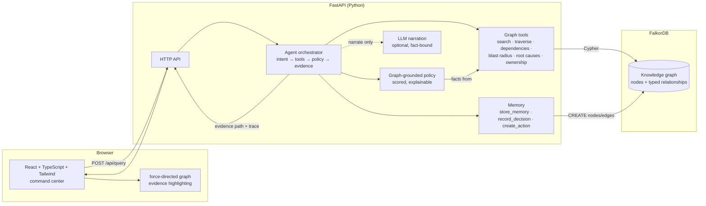
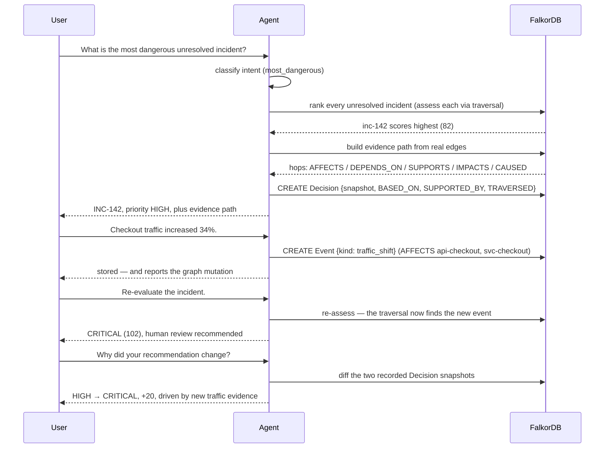

# NEXUS

**An agent that remembers not just what happened, but how everything connects.**

NEXUS is a graph-native AI incident commander. FalkorDB is not a database sitting
next to an LLM — it **is** the agent's context and memory. The agent traverses the
graph before deciding anything, every important answer carries an **evidence path**
made of relationships that actually exist, and information you give it is written
back into the graph, which changes later answers.

> **Without the graph relationships, the product does not work.**
> Remove `DEPENDS_ON`, `AFFECTS`, `CAUSED` and `SUPPORTS` from FalkorDB and NEXUS can
> no longer tell you why an incident is critical, what it threatens, or what changed.

---

## 1. Problem

Agents see pieces, not the whole picture.

An incident commander needs to know: *what broke, what caused it, what else is
affected, who owns it, has this happened before, what did it cost last time, and
what should we do next.* Every one of those questions is a **question about
relationships**. A vector store can retrieve a paragraph about a database; it
cannot tell you that the database is on the checkout transaction path and that a
previous failure of the same dependency cost $2.3M.

## 2. Why traditional agents fail

| Traditional RAG agent | Consequence |
| --- | --- |
| Chunks documents into embeddings | Relationships between services, incidents and impacts are destroyed |
| Retrieves on similarity | Cannot traverse "things that depend on this" — the blast radius |
| No path, only passages | Cannot explain *why*; answers are unfalsifiable |
| Stateless per request | New information never changes future behaviour |
| LLM decides the priority | Priority is invented, not derived, and cannot be audited |

## 3. Solution

NEXUS keeps the domain model as explicit nodes and typed relationships, and puts
graph traversal in the middle of the reasoning loop:

```
User
 ↓
Agent
 ↓
Intent understanding
 ↓
Graph retrieval / traversal      ← FalkorDB (Cypher)
 ↓
Relationship-aware context
 ↓
Deterministic, graph-grounded policy
 ↓
Decision
 ↓
Action
 ↓
Evidence path
 ↓
Memory update
 ↓
FalkorDB graph evolves           ← the next answer is different
```

The LLM, when configured, is only allowed to **narrate facts that were already
retrieved**. It never supplies a fact, a number or a relationship.

## 4. Why FalkorDB

- **Traversal is the primitive.** `MATCH (i:Incident)-[:AFFECTS]->(s)-[:DEPENDS_ON*1..3]->(d)`
  is what a blast radius *is*. Document retrieval cannot express it.
- **Cypher matches the domain.** Relationships are named, typed and directional,
  which makes the evidence path self-documenting.
- **Writes are reasoning.** Storing "traffic +34%" creates a node and edges; the
  next traversal sees it. Memory is graph mutation, not a chat log.
- **Fast enough for interactive use.** The whole 3,216-node demo graph seeds in
  ~1.5s and a full multi-hop assessment runs in well under a second.

## 5. Architecture



### Repository layout

```
NEXUS/
├── backend/
│   ├── app/
│   │   ├── graph/          client.py · schema.py · seed.py · tools.py
│   │   ├── agent/          reasoning.py · memory.py · orchestrator.py · llm.py
│   │   ├── api/routes.py   HTTP surface
│   │   ├── config.py       env-driven settings
│   │   └── main.py         FastAPI app (also serves the built UI)
│   └── tests/              32 tests against a live FalkorDB
├── frontend/               React + TS + Tailwind command center
├── scripts/verify_ui.py    Playwright end-to-end verification of the demo
├── docs/screenshots/       real screenshots captured by that script
└── docker-compose.yml      FalkorDB
```

## 6. Graph schema

**Nodes** — `Person`, `Team`, `Service`, `System`, `Database`, `API`, `Incident`,
`Event`, `Customer`, `Transaction`, `Document`, `Runbook`, `Decision`, `Evidence`,
`Action`, `Question`, `Session`, `Impact`.

**Relationships**

| Relationship | Meaning |
| --- | --- |
| `DEPENDS_ON` | Service → service/database dependency (the causal backbone) |
| `CALLS` | Service → API contract it consumes |
| `SUPPORTS` | Service → API contract it exposes |
| `AFFECTS` | Incident/Event → what it hits; service → downstream service |
| `CAUSED` | Incident → business `Impact` (carries `amount_usd`) |
| `IMPACTS` | API/Service → business outcome |
| `OWNS` / `MEMBER_OF` / `ON_CALL` / `WORKS_ON` | Ownership and humans |
| `DOCUMENTED_BY` / `TARGETS` | Runbooks and what they apply to |
| `RELATED_TO` / `PRECEDED` / `FOLLOWED` / `CONTRADICTS` | Incident history |
| `TRIGGERED` | Event → incident |
| `MENTIONED_IN` / `DERIVED_FROM` | Documents and provenance |
| `BASED_ON` / `SUPPORTED_BY` / `TRAVERSED` / `TRIGGERED` | Decision provenance |
| `PART_OF` | Service/Database → System; Impact → Impact |

`Decision TRAVERSED relationship` is modelled as `Decision -[:TRAVERSED]-> (Evidence)`
where the evidence node records the concrete hop (`src -[REL]-> dst`), because Cypher
cannot reference an edge as a node.

The seeded graph (read live from FalkorDB, never hard-coded):

```
3,216 nodes   5,809 relationships

Incident 120 · Service 40 · Database 20 · API 25 · Team 12 · Person 60
Event 604 · Evidence 200 · Decision 81 · Action 122 · Runbook 62 · Document 41
Customer 900 · Transaction 900 · Impact 8 · System 11 · Session 10
```

## 7. Agent workflow

One orchestrating agent — no unnecessary multi-agent sprawl — with **12 implemented
read tools** (only implemented tools are advertised):

`search_graph` · `get_node` · `get_entity_history` · `traverse_graph` ·
`find_dependencies` · `find_dependents` · `find_related_incidents` ·
`find_root_causes` · `get_service_ownership` · `get_runbook` · `business_impact` ·
`historical_precedents`

plus write tools: `store_memory`, `record_decision`, `create_action`.



### Graph-grounded decision policy

Priority is a **deterministic function of graph facts**, not an LLM opinion
(`backend/app/agent/reasoning.py`):

| Signal (from the graph) | Points |
| --- | --- |
| Affected service criticality: critical / high / medium | 40 / 25 / 10 |
| Transaction volume of the affected service | +1 per 10k tx/hour (cap 30) |
| A precedent incident on the same dependency caused revenue loss | +20 |
| Blast radius ≥ 3 dependent services | +10 |
| Traffic shift on the impact cone ≥ 25% / ≥ 10% | +20 / +8 |

Thresholds: `CRITICAL ≥ 85`, `HIGH ≥ 65`, `MEDIUM ≥ 40`.
`recommend_human_review = (priority == CRITICAL)`.

For incident #142 that is `40 + 12 + 20 + 10 = 82 → HIGH`. After the graph learns
about +34% traffic it becomes `82 + 20 = 102 → CRITICAL`.

## 8. Memory model

Memory is not a chat log — it is a graph write.

- **Observations.** `store_memory("Checkout traffic increased 34%")` parses the
  quantity, resolves the entity from the graph by name, then creates
  `(Event {kind:'traffic_shift', value:34, unit:'percent'})-[:AFFECTS]->(api-checkout)`
  and propagates the edge to the owning service so the whole impact cone sees it.
- **Decisions.** Every important answer is persisted:
  `Decision -[:BASED_ON]-> entity`, `-[:SUPPORTED_BY]-> Evidence(risk factor)`,
  `-[:TRAVERSED]-> Evidence(hop)`, `-[:TRIGGERED]-> Action`, together with a JSON
  *snapshot* of the assessment. That is what makes "why did you recommend this
  earlier?" answerable by reconstructing the previous graph state.
- **Sessions.** Conversation focus (`last_incident`) is itself a `Session` node.

## 9. Explainability

Every major answer returns `answer · confidence · decision · evidence path ·
reasoning summary`, and the evidence path contains **only relationships that exist
in FalkorDB** — validated by a test that re-queries every hop. Example:

```
inc-142  --[AFFECTS]-->      svc-payments      (affected service, criticality=critical)
svc-payments --[DEPENDS_ON]--> db-payments     (database dependency, 1 hop)
svc-checkout --[DEPENDS_ON]--> svc-payments    (180,000 tx/hour downstream)
svc-checkout --[SUPPORTS]-->   api-checkout    (public contract on the transaction path)
api-checkout --[IMPACTS]-->    impact-transactions
inc-91   --[CAUSED]-->         impact-revenue   (caused $2,300,000 impact)
evt-mem-… --[AFFECTS]-->       api-checkout     (new graph evidence: +34 percent)
```

The UI draws the traversed edges, animates them, and lets you click any node to
inspect its properties, history, ownership and decisions.

## 10. Demo

The signature flow, captured by `scripts/verify_ui.py` driving a real Chrome:

| Step | Screenshot |
| --- | --- |
| Graph loads (3,216 nodes / 5,809 relationships) | `docs/screenshots/01-initial-graph.png` |
| *"What is the most dangerous unresolved incident?"* → INC-142, HIGH | `docs/screenshots/02-most-dangerous.png` |
| Evidence path rendered from real edges | `docs/screenshots/03-evidence-path.png` |
| *"Checkout traffic increased 34%."* → graph mutation reported | `docs/screenshots/04-memory-write.png` |
| *"Re-evaluate the incident."* → **CRITICAL**, human review | `docs/screenshots/05-reevaluated-critical.png` |
| *"Why did your recommendation change?"* → HIGH → CRITICAL (+20) | `docs/screenshots/06-why-it-changed.png` |
| Observability: the Cypher that actually ran | `docs/screenshots/07-observability.png` |
| Entity inspector | `docs/screenshots/08-entity-inspector.png` |

Observed transcript (deterministic mode, no LLM key):

```
> What is the most dangerous unresolved incident?
  INC-142 "Payments Database connection pool exhaustion causing checkout failures"
  priority HIGH (risk score 82/100) · 12 downstream services in the blast radius
  precedent inc-91 caused $2,300,000 in revenue loss · human review NOT recommended

> Re-evaluate the incident.
  Re-assessment changed: HIGH (82.0) -> CRITICAL (102.0)
  new graph risk factor: traffic on the transaction path increased 34% (graph event)
  human review RECOMMENDED

> Why did your recommendation change?
  from HIGH (82.0) to CRITICAL (102.0), a delta of +20
  new evidence: traffic on the transaction path increased 34% (graph event)
```

## 11. Setup

**Prerequisites:** Docker, Python 3.11+, Node 18+.

```bash
git clone https://github.com/CodesbyRohit/NEXUS.git
cd NEXUS

# 1. Graph database
docker compose up -d          # FalkorDB on :6379

# 2. Backend
cd backend
python -m venv .venv
# Windows:
.venv/Scripts/python -m pip install -r requirements.txt
# macOS / Linux:
# .venv/bin/python -m pip install -r requirements.txt

cd .. && cp .env.example .env   # then edit if your FalkorDB is elsewhere
```

## 12. Environment variables

| Variable | Default | Purpose |
| --- | --- | --- |
| `FALKORDB_HOST` | `localhost` | FalkorDB host |
| `FALKORDB_PORT` | `6379` | FalkorDB port |
| `FALKORDB_GRAPH` | `nexus` | Graph name |
| `LLM_PROVIDER` | `openai` | `openai` \| `openai_compatible` \| `anthropic` \| `gemini` |
| `LLM_API_KEY` | *(empty)* | **Optional.** Empty ⇒ deterministic mode |
| `LLM_MODEL` | `gpt-4o-mini` | Narration model |
| `LLM_BASE_URL` | *(empty)* | For OpenAI-compatible endpoints (Groq, Ollama, …) |
| `CORS_ORIGINS` | `http://localhost:5173,…` | Allowed frontend origins |
| `VITE_API_BASE` | *(empty)* | Empty ⇒ same-origin (backend serves the UI) |

No secrets are ever hard-coded. `.env` is gitignored; only `.env.example` is committed.

## 13. Running locally

**Simplest: one origin.** The backend seeds the graph on first start and serves the
built frontend.

```bash
cd frontend && npm install && npm run build     # writes frontend/dist
cd ../backend && .venv/Scripts/python -m uvicorn app.main:app --port 8000
# open http://127.0.0.1:8000
```

**Development: two processes.**

```bash
# terminal 1
cd backend && .venv/Scripts/python -m uvicorn app.main:app --reload --port 8000
# terminal 2
cd frontend && npm run dev        # http://localhost:5173, proxies /api to :8000
```

The graph seeds automatically if empty. To rebuild it deliberately:

```bash
curl -X POST http://127.0.0.1:8000/api/seed -H "Content-Type: application/json" -d '{"reset":true}'
# or press "Reseed graph" in the UI header
```

### API

| Method | Path | Purpose |
| --- | --- | --- |
| `GET` | `/api/health` | FalkorDB reachability + whether LLM narration is on |
| `GET` | `/api/graph/stats` | Live node/relationship counts |
| `GET` | `/api/schema` · `/api/tools` | Schema vocabulary and implemented tools |
| `GET` | `/api/graph/overview` · `/api/graph/subgraph` | Visualisation payloads |
| `GET` | `/api/entity/{id}` | Node + neighbourhood + history + decisions + ownership |
| `GET` | `/api/incidents` | Unresolved incidents ranked by graph score |
| `POST` | `/api/query` | The agent (returns answer, decision, evidence path, trace) |
| `POST` | `/api/memory` | Write an observation into the graph |
| `GET` | `/api/decisions` | Recorded decisions (with snapshots) |
| `GET` | `/api/mutations` | Recent graph writes |
| `POST` | `/api/seed` | (Re)build the demo dataset |

Interactive docs: `http://127.0.0.1:8000/docs`.

## 14. Testing

```bash
cd backend
.venv/Scripts/python -m pytest          # 32 tests, isolated nexus_test graph
```

Coverage includes graph connection, seed integrity, service→database traversal,
blast radius, causal reasoning, evidence generation, decision persistence, API
endpoints, and the two tests that matter most:

- `test_new_information_changes_future_decision` — assert `HIGH → CRITICAL` after
  a memory write, and that the new event appears in the evidence path.
- `test_evidence_path_is_graph_derived` — re-query **every** hop to prove no
  citation was fabricated.

Browser-level end-to-end verification of the full demo:

```bash
cd backend && .venv/Scripts/python -m pip install playwright   # uses your Chrome; no browser download
cd .. && backend/.venv/Scripts/python scripts/verify_ui.py    # backend must be running on :8000
# → "OK: signature demo verified in the browser"
```

## 15. Fallback mode

If `LLM_API_KEY` is unset (or the provider errors), NEXUS runs in **deterministic
mode**: the same graph tools, the same policy and the same evidence paths, with
template narration. The mode is reported on every response (`mode:
"deterministic"`), in the health endpoint and in the UI header, so nothing is ever
presented as LLM output when it was not. This build runs deterministically end to
end; enabling an LLM changes only the prose, never the facts or the decision.

## 16. Safety / trust

The agent distinguishes **FACT** (a property or edge read from FalkorDB),
**INFERENCE** (a policy score derived from those facts), **RECOMMENDATION** (a
proposed action) and **UNKNOWN**. If the graph does not contain enough evidence the
agent says so rather than inventing it — e.g. a root-cause query on an incident with
no dependencies returns an empty candidate list.

## 17. Honesty notes

- All domain data is **synthetic** and clearly labelled as such; the seeder is
  deterministic (fixed RNG seed) so results are reproducible.
- Counts shown anywhere in the product are queried from FalkorDB at request time.
  Nothing is hard-coded or faked, including the headline 3,216 / 5,809.
- There are no placeholder buttons and no mocked endpoints. `/api/seed` writes real
  data; `/api/query` really traverses the graph.

## 18. Future roadmap

1. **More verticals on the same engine.** The schema is domain-agnostic; finance
   (counterparties, exposures), security (assets, CVEs, blast radius) and healthcare
   (patients, providers, interactions) reuse the same tools and policy shape.
2. **Temporal graph.** Incident timelines as first-class ordered edges so "what
   changed between incident 91 and 142" is a traversal, not a diff.
3. **Write-back actions.** Wire `create_action` to real runbook execution with an
   approval gate, keeping the `Decision -[:TRIGGERED]-> Action` audit trail.
4. **Retrieval evaluation.** A gold set of incident questions with expected
   evidence paths, scored automatically in CI.
5. **Multi-tenant graphs.** One graph per tenant with shared schema, plus
   read-only replicas for analytics.
